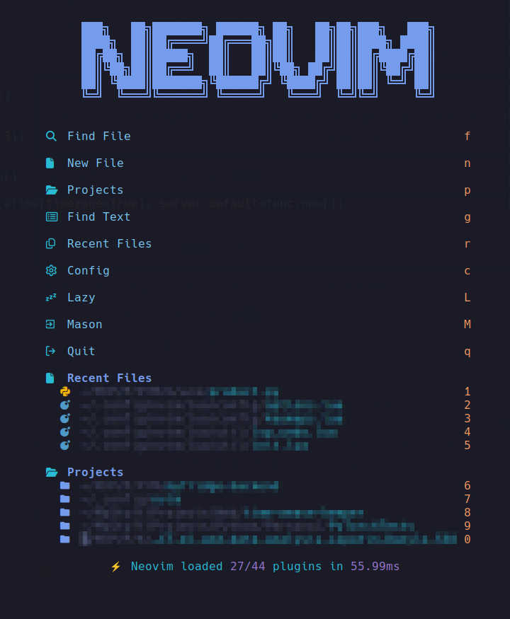

# nvim-config

Personal Neovim config on [lazy.nvim](https://github.com/folke/lazy.nvim): LSP out of
the box for Python/TS/JS/HTML/CSS/Lua/SQL, telescope as the single picker, a dashboard
with recent projects, AI assistants (Windsurf + Claude Code), and every keymap in one file.

## Table of contents

- [Dependencies](#dependencies)
- [Quick start](#quick-start)
- [Structure](#structure)
- [Plugins](#plugins)
- [Keymaps](#keymaps)
- [Indentation](#indentation)
- [Customizing](#customizing)

## Dependencies

| What | Required | Why | If missing |
|---|---|---|---|
| Neovim **0.11+** | yes | uses `vim.lsp.config`/`vim.lsp.enable`, `vim.diagnostic.jump` — none of these exist before 0.11 | the config won't start |
| `git` | yes | lazy.nvim installs and updates plugins via `git clone` | nothing to install plugins with |
| C compiler (`cc`/`gcc`/`clang`) | yes | treesitter builds parsers from source on `:TSUpdate` | syntax highlighting and treesitter-based indent won't work |
| [ripgrep](https://github.com/BurntSushi/ripgrep) (`rg`) | yes | telescope needs it for `live_grep` | `<leader>fg`, `<leader>sr`, and other search stop working |
| [fd](https://github.com/sharkdp/fd) | yes | fast file search for telescope and venv-selector | venv won't auto-discover itself, `find_files` falls back to something slow or breaks |
| Node.js + npm | yes | Mason installs `ts_ls`, `prettier`, `sqls`, etc. through it | some LSP servers and formatters won't install |
| [lazygit](https://github.com/jesseduffield/lazygit) | no | the git TUI behind `<leader>gg` / `<leader>gl` / `<leader>gf` | those three mappings error out; gitsigns still works |
| [lazydocker](https://github.com/jesseduffield/lazydocker) | no | the docker TUI behind `<leader>td` | that mapping opens an empty terminal |
| [Nerd Font](https://www.nerdfonts.com/) in your terminal | no | icons in the dashboard, file tree, statusline, git/diagnostic signs | icons show as blank boxes or garbled glyphs; nothing else breaks |
| Python 3 + `pip` | no, but needed for Python projects | `basedpyright`/`ruff`/`black` don't need a system Python themselves, but project venvs do | venv-selector (`<leader>vs`) has nothing to find |

On Debian/Ubuntu, `fd` is often packaged as `fd-find` and only available as `fdfind` —
in that case pass `options = { fd_binary_name = "fdfind" }` to `venv-selector.nvim`
in `lua/plugins/lang.lua`.



## Quick start

```bash
git clone <repo-url> ~/.config/nvim
nvim
```

On first launch, lazy.nvim clones itself and installs every plugin — wait for the
progress indicator in the corner to disappear. From there:

- `:Lazy` — plugin status, updates, startup profile
- `:Mason` — LSP server and formatter status; they install automatically on startup
- `:checkhealth` — start here if something isn't working

The dashboard opens by itself when you launch Neovim without a file — it also lists
the hotkeys (`f`/`p`/`g`/`r`/`c`).

## Structure

```
init.lua                    -- entry point: options -> keymaps -> autocmds -> lazy.nvim bootstrap

lua/config/
  options.lua                -- vim.opt, indent, leader
  keymaps.lua                -- EVERY keymap in the config, one file
  autocmds.lua                -- indent overrides for lua/js/ts/html/css/json/yaml

lua/plugins/                 -- one file per plugin theme
  lsp.lua                     -- mason, lspconfig, lspsaga, trouble
  completion.lua               -- nvim-cmp, autopairs
  editor.lua                  -- treesitter, flash, multicursor, harpoon, grug-far, conform
  files.lua                   -- neo-tree, telescope
  git.lua                     -- gitsigns
  lang.lua                    -- venv-selector, jupytext, render-markdown
  ai.lua                      -- windsurf, copilot, claudecode
  terminal.lua                -- toggleterm
  snacks.lua                  -- dashboard and its project picker
  ui.lua                      -- theme, statusline, tabs, which-key, notifications, etc.

lua/util/
  init.lua                    -- project root lookup (util.root / util.find_root)
  lsp_undo.lua                 -- undo multi-file LSP edits (<leader>ru)
```

## Plugins

### LSP and code
| Plugin | What it's for |
|---|---|
| `mason.nvim` + `mason-lspconfig` + `mason-tool-installer` | installs and updates LSP servers and formatters |
| `nvim-lspconfig` | wires up LSP: `basedpyright` (Python), `ts_ls` (JS/TS), `html`, `cssls`, `lua_ls`, `sqls` |
| `lspsaga.nvim` | floating windows for definition/finder/rename/code action/line diagnostics |
| `trouble.nvim` | persistent panel for diagnostics/references/quickfix at the bottom |
| `conform.nvim` | formatting: stylua (Lua), ruff/black (Python), prettier (JS/TS/HTML/CSS/JSON/YAML/MD), sql_formatter |
| `nvim-treesitter` | syntax highlighting and indent via parsers (pinned to `master`) |

### Completion and AI
| Plugin | What it's for |
|---|---|
| `nvim-cmp` + `cmp-nvim-lsp`/`cmp-buffer`/`cmp-path` | autocompletion |
| `nvim-autopairs` | auto-closes brackets/quotes |
| `windsurf.vim` | inline AI suggestions, no monthly quota (`:Codeium Auth` once) |
| `copilot.vim` | inline GitHub Copilot suggestions, installed but disabled by default |
| `claudecode.nvim` | Claude Code inside the editor |

### Navigation and search
| Plugin | What it's for |
|---|---|
| `telescope.nvim` | the one picker: files, grep, buffers, colorschemes |
| `neo-tree.nvim` | file tree |
| `harpoon` (branch `harpoon2`) | quick bookmarks for up to 6 files |
| `flash.nvim` | jump to visible text (`s`) |
| `grug-far.nvim` | search and replace across the project/file/selection |
| `multicursor.nvim` | multiple cursors |

### Git
| Plugin | What it's for |
|---|---|
| `gitsigns.nvim` | change markers in the gutter, stage/reset by hunk |
| `snacks.lazygit` | opens the `lazygit` TUI in a float, themed from the colorscheme |

### Languages
| Plugin | What it's for |
|---|---|
| `venv-selector.nvim` | picks and auto-activates a Python virtualenv (`.venv`) |
| `jupytext.nvim` | opens `.ipynb` files as plain python |
| `render-markdown.nvim` | renders markdown right in the buffer |

### UI
| Plugin | What it's for |
|---|---|
| `tokyonight.nvim` | color scheme |
| `snacks.nvim` | dashboard with recent projects and recent files |
| `lualine.nvim` | statusline |
| `bufferline.nvim` | buffer tabs |
| `which-key.nvim` | shows hints for `<leader>` prefixes |
| `indent-blankline.nvim` | indent guides |
| `nvim-colorizer.lua` | highlights colors (`#fff`, `rgb(...)`) inline |
| `noice.nvim` + `nvim-notify` | nicer cmdline and notifications |
| `nvim-scrollbar` + `nvim-hlslens` | scrollbar with git/diagnostic/search marks, plus a match counter while searching |
| `toggleterm.nvim` | built-in terminal |
| `overseer.nvim` | task runner: make/npm/cargo/shell tasks with a status list |
| `snacks.terminal` | opens the `lazydocker` TUI in a float |

## Keymaps

Leader is **Space**. The full list lives in `lua/config/keymaps.lua` (with `desc`, so
`which-key` shows it inside Neovim too — just press `<leader>` and wait).

### General
| Key | Action |
|---|---|
| `<Esc>` | Clear search highlight |
| `n` / `N` | Next / previous search match (with counter) |
| `*` / `#` | Search word under cursor |
| `<leader>R` | Save all and restart Neovim |
| `<leader>F` | Format buffer |
| `s` | Flash: jump to text |

### Windows and buffers
| Key | Action |
|---|---|
| `<C-h/j/k/l>` | Move between windows |
| `<A-h/j/k/l>` | Resize window |
| `<S-h>` / `<S-l>` | Previous / next buffer |
| `<leader>bd` | Close buffer |
| `<leader>b1..9` | Go to buffer by number |

### `<leader>f` — Find / Files
| Key | Action |
|---|---|
| `<leader>ff` | Find files |
| `<leader>fg` | Live grep |
| `<leader>fb` | List buffers |
| `<leader>fh` | Search `:help` |
| `<leader>e` | Toggle file tree |
| `<leader>fe` | Focus file tree |

### `<leader>s` — Search & Replace
| Key | Action |
|---|---|
| `<leader>sr` | Search & replace across the project (or the selection, in visual mode) |
| `<leader>sw` | Search & replace the word under cursor |
| `<leader>sf` | Search & replace in the current file |

### LSP and code
| Key | Action |
|---|---|
| `gd` | Go to definition |
| `gr` | Find references |
| `K` | Hover docs |
| `<leader>ca` | Code action |
| `<leader>rn` | Rename symbol |
| `<leader>rN` | Rename symbol (project-wide) |
| `<leader>ru` | Undo the last LSP edit across all files |

### `<leader>x` — Diagnostics
| Key | Action |
|---|---|
| `de` | Line diagnostics |
| `[d` / `]d` | Previous / next diagnostic |
| `<leader>xx` | All diagnostics (Trouble) |
| `<leader>xw` | Buffer diagnostics |
| `<leader>xr` / `<leader>xd` | References / Definitions (Trouble) |
| `<leader>xq` / `<leader>xl` | Quickfix / Loclist |

### `<leader>g` — Git
| Key | Action |
|---|---|
| `]h` / `[h` | Next / previous hunk |
| `<leader>gs` | Stage hunk |
| `<leader>gr` | Reset hunk |
| `<leader>gp` | Preview hunk |
| `<leader>gg` | Lazygit (project root) |
| `<leader>gl` | Lazygit log |
| `<leader>gf` | Lazygit history for the current file |

### `<leader>h` — Harpoon
| Key | Action |
|---|---|
| `<leader>ha` | Add file |
| `<leader>hd` | Remove file |
| `<C-e>` | Toggle Harpoon menu |
| `<leader>1..6` | Go to file by number |

### `<leader>m` — Multicursor
| Key | Action |
|---|---|
| `<C-n>` | Add cursor at next match |
| `<C-x>` | Skip match |
| `<C-Up>` / `<C-Down>` | Add cursor above / below |
| `<leader>ma` | Add cursor to every match |
| `<C-Left>` / `<C-Right>` / `<C-q>` | Navigate cursors (only while multiple cursors are active) |

### `<leader>t` — Terminal
| Key | Action |
|---|---|
| `<C-\>` | Toggle terminal (from normal, insert, or terminal mode) |
| `<leader>tt` | Terminal at the bottom |
| `<leader>tf` | Floating terminal |
| `<leader>ts` | Select terminal |
| `<leader>t1..9` | Terminal by number |
| `<leader>td` | Lazydocker (project root) |
| `<leader>tp` | Run the current python file in a terminal |

### `<leader>o` — Overseer / Tasks
| Key | Action |
|---|---|
| `<leader>oo` | Toggle the task list |
| `<leader>or` | Run a task from a template (make, npm, cargo, …) |
| `<leader>oc` | Run a shell command as a task |
| `<leader>oa` | Action on the most recent task (restart, stop, open output) |
| `<leader>ot` | Action on a task picked from the list |
| `<leader>ob` | Build a task interactively |
| `<leader>oi` | Overseer debug info |

### `<leader>a` — AI / Claude
| Key | Action |
|---|---|
| `<Tab>` (insert) | Accept AI suggestion (Windsurf, or Copilot when enabled) |
| `<leader>aa` | Open Claude Code (or send selection) |
| `<leader>af` | Focus Claude window |
| `<leader>ab` | Add current file to Claude's context |
| `<leader>am` | Select Claude model |

### Misc
| Key | Action |
|---|---|
| `<leader>ut` | Pick a colorscheme (with preview) |
| `<leader>uc` | Toggle colorizer |
| `<leader>vs` | Select Python virtualenv |
| `<leader>"` `'` `)` `]` `}` | Surround word with quotes/brackets |

## Indentation

4 spaces globally (`lua/config/options.lua`). 2-space overrides: Lua,
JS/TS/HTML/CSS/JSON/YAML (`lua/config/autocmds.lua`). Python has no override of its
own — Neovim's built-in `ftplugin/python.vim` already does 4 spaces (PEP8).

## Customizing

House rule: **keymaps live only in `keymaps.lua`**, plugin specs never set them
(the one exception is multicursor's `mc.addKeymapLayer` in `editor.lua` — that's the
plugin's own API, not a keymap). Keep that same split when editing a plugin or adding
your own.

**Add a plugin.** Specs are plain lazy.nvim tables, each in whichever theme file fits
(see [Structure](#structure)); if none fit, start a new file under `lua/plugins/` —
lazy.nvim picks it up on its own (`require("lazy").setup("plugins")` in `init.lua`
scans the whole folder). Minimal spec:

```lua
{
  "author/plugin.nvim",
  opts = {},         -- if the plugin supports setup(opts)
  -- event / cmd / ft / keys -- if the plugin should load lazily
}
```

**Add a keymap.** One `map(...)` call in `lua/config/keymaps.lua`, in whichever
section fits (they're split by comment headers). Shape:

```lua
map("n", "<leader>xy", function()
  require("plugin").some_function()
end, { desc = "What it does" })
```

`desc` is required — without it which-key won't show a hint. If you add a new
`<leader>X` prefix, list it in the table at the top of `keymaps.lua` and add a group
to `which-key.nvim`'s `spec` (`lua/plugins/ui.lua`).

**Add an LSP server.** In `lua/plugins/lsp.lua`: the server name goes in
`mason-lspconfig`'s `ensure_installed`, then `vim.lsp.config("name", { capabilities =
capabilities, ... })`, then into the `vim.lsp.enable({...})` list. The name is
whatever's in the [Mason registry](https://mason-registry.dev/registry/list), not
`lspconfig`'s.

**Add a formatter.** In `lua/plugins/editor.lua`, under `conform.nvim`: the filetype
and tool go in `formatters_by_ft`; if the tool isn't installed yet, add it to
`mason-tool-installer`'s `ensure_installed` (`lua/plugins/lsp.lua`) so Mason installs
it on the next launch.
